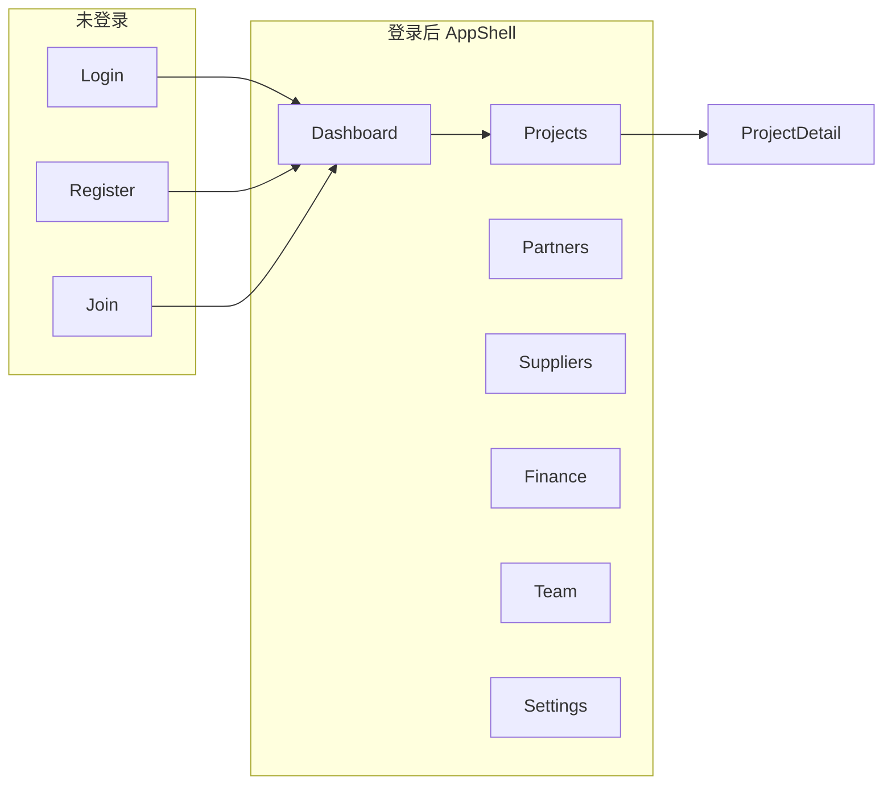

# 接团通 PRD 可点击原型（React + Vite）

## 现状与差距

已有静态原型 [`prototype/index.html`](prototype/index.html) + [`prototype/app.js`](prototype/app.js)，但与 PRD 偏差较大：

| 维度 | 现有原型 | PRD 要求 |
|------|----------|----------|
| 品牌/样例 | 地接社管理平台、云南/YN 团号、邮箱登录 | **接团通**、新疆/XJ 语境团号、**手机号**登录 |
| 布局 | 左侧图标栏 52px + 原型导航 210px | **220px 文字侧栏** + **顶栏全局搜索** |
| 页面 | 12 页，接团核算单页 | **三 Tab 团详情**、**全局收支**、**/join 邀请** |
| 工作台 | 3 统计卡 + 趋势图 | **4 卡**（本月接团/在途/本月毛利/逾期）+ **待办节点列表** |
| 状态枚举 | 执行中/待结算 | pending/ongoing/completed/settled/cancelled |

根目录尚无 `package.json`，需从零脚手架；现有 `node_modules` 为文档工具依赖，与前端原型无关。

---

## 目标交付

- 目录：[`web/`](web/)（与实施计划 [`旅行社_cloudflare_平台_f837cdde.plan.md`](.cursor/plans/旅行社_cloudflare_平台_f837cdde.plan.md) 中 scaffold todo 对齐，原型可直接演进为正式前端）
- 启动：`cd web && npm install && npm run dev`
- 覆盖 **P0 + P1** 共 **15 个可导航视图**（见下表），Mock 数据统一为 **新疆地接社** 业务场景（见下文「Mock 数据规范」）



### 页面清单

| # | 路由 | 页面 | PRD 来源 |
|---|------|------|----------|
| 1 | `/login` | 登录（手机号+密码，错误态可切换演示） | 3.1 |
| 2 | `/register` | 创建地接社 | 3.1 |
| 3 | `/join/:code` | 邀请加入（预填 `8FK2-9D3A`） | 3.1 |
| 4 | `/dashboard` | 工作台 4 卡 + 待办节点 + 最近团 | 3.2 |
| 5 | `/projects` | 接团单列表（筛选/搜索） | 3.5 |
| 6 | `/projects/new` | 新建接团单表单 | 3.5 |
| 7 | `/projects/:id` | 团详情三 Tab：基本信息 / 收支明细 / 收付款节点 | 3.5 + 3.6 |
| 8 | `/partners` | 合作方列表 + 侧滑新增 | 3.3 |
| 9 | `/partners/:id` | 合作方详情（档案 + 历史团 + 未结清） | 3.3 |
| 10 | `/suppliers` | 供应商列表（6 类筛选） | 3.4 |
| 11 | `/finance` | 全局收支流水（跨团） | 3.6 |
| 12 | `/team` | 员工列表 + 邀请链接管理 | 3.7 |
| 13 | `/settings` | 企业信息 | 3.7 |

另加 **浮动「原型导航」面板**（可折叠），一键跳转以上页面，保留旧原型评审体验。

---

## 技术方案

### 依赖（最小集）

- `react` + `react-dom` + `react-router-dom` — 路由与页面
- `typescript` + `vite` — 构建
- `dayjs` — 逾期天数计算（与 PRD 第六章一致）
- **不引入** antd / react-query / zod（原型阶段用 mock，正式开发再加）

### 目录结构

```
web/
  package.json
  vite.config.ts
  index.html
  src/
    main.tsx
    App.tsx
    routes.tsx
    styles/variables.css      # --primary: #1eb2a6 等 PRD 青绿主题
    layouts/AppShell.tsx      # 顶栏 + 220px 侧栏 + 内容区 max 1200px
    layouts/AuthLayout.tsx
    components/               # Sidebar, TopBar, SearchBar, StatCard, Table, Drawer, Badge
    pages/                    # 按模块分目录
    mocks/
      data.ts                 # 乌鲁木齐丝路地接社全套样例（新疆场景）
      store.ts                # 简单 useState 上下文，支持标记节点/切换状态
    types/index.ts            # 对齐 PRD 第五章实体
```

### 布局实现（对齐 PRD 第二章 ASCII）

```
+-- TopBar: [接团通] 乌鲁木齐丝路地接社  [搜索团号/合作方…]  [马总 ▾]
+-- Sidebar 220px: 工作台 | 接团单 | 合作方 | 供应商 | 收支 | 员工 | 设置
+-- Main: 页面标题 + 主操作 + 筛选条 + 主体（表格/表单）
```

### Mock 数据层

在 [`mocks/data.ts`](web/src/mocks/data.ts) 预置 **新疆地接社** 全套样例（团号格式仍沿用 PRD 的 `JTT-YYYYMMDD-NN`，线路/供应商/合作方全部新疆语境）：

#### Mock 数据规范（新疆场景）

| 实体 | 字段 | 样例值 |
|------|------|--------|
| 企业 | name | 乌鲁木齐丝路地接社 |
| 企业 | 备注 | 主营北疆环线、伊犁、天山天池；旺季 6–9 月 |
| 用户 owner | 马建国 / 1389912xxxx | 老板 |
| 用户 member | 阿丽 / 1399988xxxx | 计调 |
| 用户 member | 王姐 / 1370991xxxx | 财务 |
| 合作方 | 上海国旅 | 对接人张经理，月结 30 天，累计 24 团，未结清 ¥45,200 |
| 合作方 | 广之旅 | 对接人李计调，单团结，累计 11 团 |
| 合作方 | 北京中青旅 | 对接人周经理，月结 45 天，未结清 ¥18,600 |
| 供应商·酒店 | 乌鲁木齐友好饭店 | 预付，累计成本 ¥186,400 |
| 供应商·酒店 | 喀纳斯禾木山居 | 现结，未付 ¥12,800 |
| 供应商·用车 | 新疆西域运输车队 | 33 座大巴，现结 |
| 供应商·门票 | 喀纳斯景区票务中心 | 预付 |
| 供应商·导服 | 导游-努尔兰 | 单团结，哈萨克语+普通话 |
| 供应商·餐饮 | 吐鲁番葡萄庄园餐厅 | 团餐协议价 |
| 接团单 A | JTT-20260615-01 | 北疆环线 8 日 · 上海国旅 · 42 人 · 进行中 · 毛利 ¥12,600 |
| 接团单 B | JTT-20260608-02 | 伊犁薰衣草 6 日 · 广之旅 · 18 人 · 待确认 |
| 接团单 C | JTT-20260601-03 | 天山天池+吐鲁番 5 日 · 北京中青旅 · 28 人 · 已完成 · 未结清 ¥18,600 |
| 收支示例 | 收入 | 06.15 团款定金 上海国旅 +¥86,000 |
| 收支示例 | 支出 | 06.15 酒店·3 晚 友好饭店 -¥38,400 |
| 收支示例 | 支出 | 06.16 用车·8 天 西域车队 -¥9,600 |
| 收支示例 | 支出 | 06.17 门票·喀纳斯 景区票务 -¥15,200 |
| 节点·逾期应收 | 北京中青旅尾款 | JTT-20260601-03 · ¥18,600 · 逾期 2 天 |
| 节点·逾期应付 | 禾木山居尾款 | JTT-20260615-01 · ¥12,800 · 逾期 1 天 |
| 节点·即将到期 | 上海国旅尾款 | JTT-20260615-01 · ¥60,200 · 3 天后到期 |
| 备注文案 | 接团单备注 | 含喀纳斯区间车；2 晚乌鲁木齐+1 晚布尔津+1 晚禾木；需安排清真餐 |
| 邀请页 | 企业名展示 | 「乌鲁木齐丝路地接社」邀请你加入 |

工作台 4 卡聚合数字（与上表一致，实现时从 mock 推导或硬编码对齐）：

- 本月接团 14 团 · 在途 5 团 · 本月毛利 ¥128,400 · 逾期应收 ¥31,400 / 2 笔

[`mocks/store.ts`](web/src/mocks/store.ts) 提供轻量 React Context：

- `markScheduleDone(id)` — 标记节点已收/已付，联动工作台数字
- `updateProjectStatus(id, status)` — 状态流转演示
- `search(query)` — 顶栏搜索返回团号/合作方下拉

无持久化；刷新恢复初始数据。

### 关键交互（可点击，非静态截图）

1. **顶栏搜索**：输入 `0601` 或 `北疆` 弹出匹配团号/团名，回车跳转 `JTT-20260601-03` 团详情收付款 Tab
2. **团详情 Tab**：基本信息 / 收支明细 / 收付款节点切换；节点行「标记已收」即时更新样式
3. **侧滑表单**：合作方新增、记一笔收支（金额 > ¥100,000 显示 PRD 警告条）
4. **工作台节点行**：点击跳转团详情并高亮对应节点 2 秒
5. **登录/注册**：任意提交跳转 `/dashboard`（原型不做真实校验）

### 明确不做（P2+ 或正式开发）

- 真实 API / JWT / D1
- XLSX 导出、批量 zip
- 空状态全套、5 种错误态演示页（除非单页内嵌切换）
- 移动端 ≤768px 完整适配（桌面优先 ≥1280px）
- 供应商独立详情页（P1 仅需列表 + 支出关联展示）

---

## 实施顺序

按 PRD 第十一章依赖关系，先壳后页：

1. **脚手架 + 主题 CSS + 类型定义** — 解锁所有页面
2. **AppShell + 路由骨架 + 原型导航** — 可空页跳转
3. **Mock 数据 + Store** — 数据一致
4. **认证三页** — 登录流闭环
5. **合作方列表/详情** — 建团前置依赖
6. **接团单列表/新建/详情三 Tab** — 核心实体
7. **工作台** — 聚合展示
8. **供应商 + 全局收支 + 员工 + 设置** — 补齐 P1
9. **顶栏搜索 + 节点标记联动** — 差异化体验打磨
10. **README** — 启动方式 + 推荐演示路径

---

## 演示路径（写入 README）

1. `/register` 创建「乌鲁木齐丝路地接社」→ `/dashboard` 看逾期卡片（北京中青旅尾款 + 禾木山居应付）
2. `/partners` 查看北京中青旅未结清 ¥18,600 → `/projects/new` 建北疆团
3. `/projects/JTT-20260615-01` 收支 Tab 记一笔（西域车队用车费）→ 收付款 Tab 标记禾木山居逾期节点
4. 顶栏搜索 `0601` 或 `北疆` 快速定位团
5. `/team` 复制邀请链接 → `/join/8FK2-9D3A` 演示加入「乌鲁木齐丝路地接社」

---

## 与旧原型的关系

- **不删除** [`prototype/`](prototype/) — 保留作备份
- 在旧 `index.html` 顶部加一行注释指向 `web/` 新原型（一行改动，避免评审混淆）
