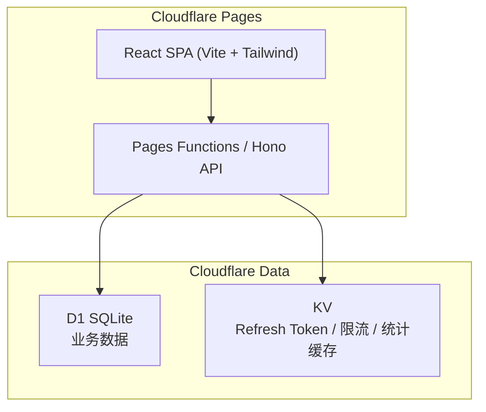
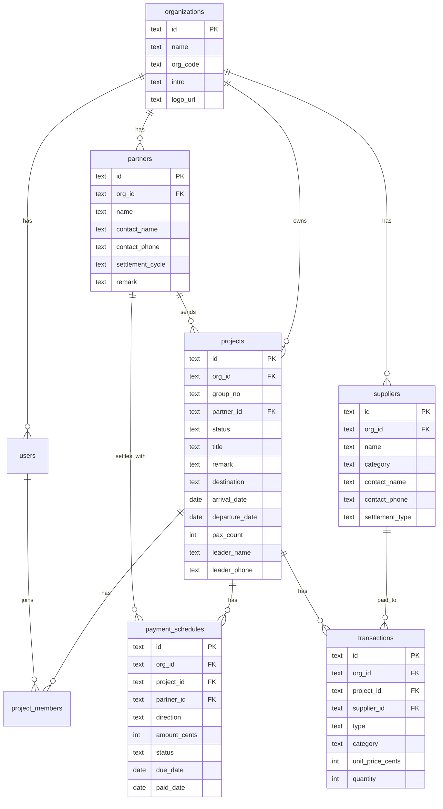
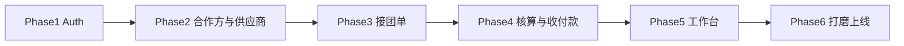

# 地接社管理平台（Cloudflare 全栈）实施计划

## 产品定位（地接社优先）

**目标用户：** 中小 **地接社 / 本地旅行社**（接上游组团社的团，在当地安排资源、核算成本、对上游结算）。

**核心价值：** 用 **团号** 管好每一单接团，清楚 **应收（组团社）/ 应付（供应商）** 多少、何时收付，避免 Excel 对账混乱。

**与参考产品（路书星球）的差异：**

| 维度 | 参考产品（组团社导向） | 本产品（地接社导向） |
|------|----------------------|---------------------|
| 「客户」 | 散客 CRM、星级、跟进 | **合作组团社**（B2B）为主 |
| 「项目」 | 卖方案、做行程 | **接团单**（团号、人数、抵离日期） |
| 成本 | 内部核价 | **供应商**（酒店/车队/导游）+ 对上游报价 |
| 结算 | 费用明细 | 明细 + **收付款节点**（定金/尾款/账期） |
| 不做 | 行程编辑器 | 同样不做；用备注 + 附件 URL（后期） |

你已确认：**多租户隔离**、**第一版不做附件（不引入 R2）**、**优先服务地接社**。

**交互原型（审阅用）：** 地接社 v2 — [prototype/index.html](../../prototype/index.html) + [app.js](../../prototype/app.js)，详见 [html-prototype.md](html-prototype.md)。

**产品需求文档（PRD）：** [PRD-接团通-地接社平台.md](PRD-接团通-地接社平台.md) — 十一节完整 PRD，可直接指导 AI 实现。

---

## 版本路线图

### MVP v1（第一版交付）

- 企业注册 / 员工 / 邀请码
- **合作方**（组团社）档案
- **接团单**（团号、合作方、人数、日期、状态、备注、计调成员）
- **供应商** 简易名录
- 接团 **收支明细**（应收/应付分类，关联供应商）
- **收付款节点**（计划日、实际日、逾期状态）— 结算核心
- 工作台：在团数、待结算、逾期应收

### v1.5（上线后快速迭代）

- 按合作方 **月度对账单** 汇总（多团合并）
- 报价多方案（同团多个报价快照，确认其一）
- 导出 Excel / 简易 PDF 确认书
- 项目级提醒（尾款到期、出团前 N 天）

### v2（验证付费后再做）

- 只读分享链接（给上游社看团单摘要，不含成本）
- 销售/计调提成规则
- 多币种 + 手动汇率
- 游客/领队联系人（轻量，不做完整散客 CRM）

---

## 技术架构



### 选型理由（贴合免费额度）

- **[Cloudflare Pages](https://developers.cloudflare.com/pages/)**：托管 React 静态资源 + Functions，单仓库统一部署。
- **D1**：客户、项目、收支、跟进等关系型数据；多租户用 `org_id` 列隔离，单库即可（免费 5GB / 日读限额对小团队足够）。
- **KV**：存 Refresh Token、登录限流计数、首页统计短缓存（TTL 5 分钟）；Access Token 用 JWT 无状态校验，不每次查 KV。
- **不引入 R2 / Workers AI / Queues**：控制复杂度与成本；Logo 用 URL 文本字段。

### 推荐技术栈

| 层 | 技术 |
|----|------|
| 前端 | React 19 + Vite + TypeScript + Tailwind CSS + [shadcn/ui](https://ui.shadcn.com/) |
| 路由 | TanStack Router 或 React Router |
| API | Hono（运行在 Pages Functions `functions/api/[[route]].ts`） |
| ORM | Drizzle ORM + `drizzle-kit` 迁移 |
| 校验 | Zod |
| 密码 | Web Crypto `PBKDF2`（Workers 原生，无 bcrypt 依赖） |
| 部署 | Wrangler + Git 连 Pages CI |

---

## 多租户与权限模型



**角色（地接社场景）：**

- `owner`：老板；企业信息、员工、全部数据、财务。
- `admin`：管理员 / 财务；合作方、供应商、接团、收付款。
- `coordinator`：计调；接团单 CRUD、收支录入、供应商关联（不可管员工）。
- `staff`：跟单 / 导游等；只读或仅编辑被分配的接团单（第一版可与 coordinator 合并，后续再拆）。

**接团单状态流（`projects.status`）：**

```
inquiry → quoted → confirmed → in_progress → pending_settlement → settled → closed
 询价      已报价    已确认       执行中         待结算           已结清      关闭
```

第一版 UI 可简化为 5 档：**询价/报价中** · **已确认待接团** · **执行中** · **待结算** · **已结清**。

**租户隔离规则：** 所有 API 从 JWT Claims 取 `org_id` + `user_id` + `role`，查询/写入必须带 `WHERE org_id = ?`；子表同样含 `org_id` 冗余列。跨租户访问一律 404。

**注册流程：**

1. **创建企业**：地接社名称 + 管理员 → `organizations` + `users(role=owner)`。
2. **员工加入**：D1 `invites` 表邀请码（7 天、一次性、`used_by`）。

---

## D1 表结构（核心）

[`migrations/0001_init.sql`](migrations/0001_init.sql)（Drizzle 生成）大致包含：

```sql
-- 企业与用户
organizations (id, name, org_code, intro, logo_url, created_at)
users (id, org_id, email, password_hash, name, role, is_active, created_at)
invites (id, org_id, code, expires_at, used_by, created_by, created_at)

-- 合作方（上游组团社）— 地接社核心「客户」
partners (
  id, org_id, name,
  contact_name, contact_phone, contact_wechat, contact_email,
  settlement_cycle,   -- immediate | monthly | per_group
  credit_days,        -- 账期天数，如 30
  remark,
  owner_user_id, deleted_at, created_at, updated_at
)

-- 供应商（本地资源方）
suppliers (
  id, org_id, name,
  category,           -- hotel | fleet | guide | ticket | restaurant | other
  contact_name, contact_phone,
  settlement_type,    -- prepaid | postpaid | cash
  remark, deleted_at, created_at, updated_at
)

-- 接团单
projects (
  id, org_id,
  group_no,           -- 团号，地接社内部唯一（org 内 UK）
  partner_id,         -- 合作组团社 FK
  title,              -- 团名/线路简述
  status,             -- inquiry | quoted | confirmed | in_progress | pending_settlement | settled | closed
  destination,        -- 接待地区/线路
  arrival_date, departure_date,
  pax_count,          -- 人数
  leader_name, leader_phone,  -- 领队/全陪（替代散客 CRM）
  remark,             -- 接团备注（行程要点、特殊要求）
  quote_version,      -- v1.5：当前生效报价方案号
  is_starred,
  created_by, updated_by, deleted_at, created_at, updated_at
)
project_members (project_id, user_id, role)  -- coordinator | guide | finance

-- 收支明细；expense 可关联 supplier_id
transactions (
  id, org_id, project_id,
  type,               -- income（应收/上游报价）| expense（应付/成本）
  category,           -- hotel | fleet | guide | ticket | meal | other
  supplier_id,        -- nullable；expense 时关联供应商
  item_name, option_name,
  unit_price_cents integer NOT NULL,
  quantity integer NOT NULL,
  occurred_at, created_by, created_at, updated_at
)

-- 收付款节点（结算核心）
payment_schedules (
  id, org_id, project_id,
  partner_id,         -- receivable 时：向哪个合作方收
  supplier_id,        -- payable 时：向哪个供应商付
  direction,          -- receivable | payable
  label,              -- 定金 | 尾款 | 预付款 | 月结账
  amount_cents integer NOT NULL,
  due_date, paid_date,
  status,             -- pending | paid | overdue | cancelled
  remark, created_by, created_at, updated_at
)
```

**金额约定：** DB 存 `*_cents`（分）；前端展示 ÷100；提交 `Math.round(yuan * 100)`。

**索引：**

```sql
CREATE UNIQUE INDEX idx_projects_org_group_no ON projects(org_id, group_no);
CREATE INDEX idx_projects_org_arrival ON projects(org_id, arrival_date DESC);
CREATE INDEX idx_projects_org_status ON projects(org_id, status);
CREATE INDEX idx_projects_org_partner ON projects(org_id, partner_id);
CREATE INDEX idx_partners_org_updated ON partners(org_id, updated_at DESC);
CREATE INDEX idx_suppliers_org_category ON suppliers(org_id, category);
CREATE INDEX idx_transactions_org_project ON transactions(org_id, project_id);
CREATE INDEX idx_payment_schedules_org_due ON payment_schedules(org_id, due_date, status);
CREATE UNIQUE INDEX idx_users_org_email ON users(org_id, email);
```

**v1 不做：** `customers` 散客表、跟进记录 `follow_ups`（组团社 CRM 能力延后至 v2）。

---

## 认证方案（JWT + Refresh Token）

| 组件 | 存储 | 说明 |
|------|------|------|
| Access Token | JWT（无状态） | Claims: `sub`, `orgId`, `role`；有效期 **15 分钟**；`Authorization: Bearer` 或短生命周期 Cookie |
| Refresh Token | KV | Key: `refresh:{tokenId}` → `{userId, orgId, role}`；有效期 **7 天**；`HttpOnly` Cookie `refresh_token` |
| 登出/撤销 | KV delete | 删除对应 `refresh:{tokenId}` 即可失效 refresh；access token 自然过期 |
| 限流 | KV | `ratelimit:login:{ip}`，15 分钟窗口 |

**为何不用纯 KV Session：** 每次 API 请求查 KV 有延迟与读次数成本；JWT 校验本地完成，仅 refresh 时触 KV。

**环境变量：** `JWT_SECRET`（Pages Secrets / `.dev.vars` 本地）；**不再使用** `SESSION_SECRET` 混称。

Refresh 流程：`POST /auth/refresh` 校验 KV 中的 refresh token → 签发新 access JWT（可选轮换 refresh token）。

**KV 其他用途：**

| Key 模式 | 用途 | TTL |
|----------|------|-----|
| `refresh:{tokenId}` | Refresh Token 元数据 | 7 天 |
| `ratelimit:login:{ip}` | 防暴力破解 | 15 分钟 |
| `cache:stats:{orgId}` | 首页项目统计 JSON | 5 分钟 |

---

## API 设计（Hono 路由）

统一前缀 `/api/v1`，主要端点：

| 域 | 端点 | 说明 |
|----|------|------|
| Auth | `POST /auth/register-org` | 创建地接社 + Owner |
| Auth | `POST /auth/register-invite` | 邀请码注册员工 |
| Auth | `POST /auth/login` `POST /auth/logout` `GET /auth/me` `POST /auth/refresh` | 认证 |
| Org | `GET/PUT /org` | 企业信息 |
| Users | `GET/POST/PATCH/DELETE /users` | 员工 + 邀请码 |
| Partners | `GET/POST/PATCH/DELETE /partners` | 合作组团社 |
| Suppliers | `GET/POST/PATCH/DELETE /suppliers` | 供应商名录 |
| Projects | `GET/POST/PATCH/DELETE /projects` | 接团单（团号、状态、合作方） |
| Projects | `GET/POST/PATCH/DELETE /projects/:id/transactions` | 收支明细 |
| Projects | `GET/POST/PATCH/DELETE /projects/:id/payments` | 收付款节点 |
| Dashboard | `GET /dashboard/stats` | 在团/待结算/逾期应收、近期抵团 |

所有写操作记录 `updated_by`；列表默认按 `updated_at DESC`（对齐参考图「按更新时间排序」）。

### 分页规范（Cursor-based，禁止 OFFSET）

D1/SQLite 大数据量下 `OFFSET` 性能差，统一 cursor 分页：

**请求参数：**

| 参数 | 类型 | 默认 | 说明 |
|------|------|------|------|
| `limit` | int | 20 | 1–100 |
| `cursor` | string | — | opaque；首次请求不传 |

**响应结构：**

```json
{
  "data": [...],
  "pageInfo": {
    "nextCursor": "eyJ1cGRhdGVkQXQiOi...",
    "hasMore": true
  }
}
```

**Cursor 编码：** Base64 JSON `{"updatedAt":"2024-01-01T00:00:00Z","id":"uuid"}`；SQL 用复合条件 `(updated_at, id) < (?, ?) ORDER BY updated_at DESC, id DESC LIMIT ?`（keyset pagination）。

客户列表若按 `created_at` 排序，cursor 字段随排序键调整，但同一 endpoint 排序键固定。

---

## 前端页面与参考 UI 对齐

参考 [参考/](参考/) 文件夹的 **青绿色 (#1eb2a6 系) + 白底 + 左侧图标导航** 风格。

### 布局壳（全局）

- 左侧窄栏：**工作台** · **接团单** · **合作方** · **供应商** · **设置**
- 顶栏：模块标题、**逾期应收提醒**（计数）、用户下拉

### 页面清单（地接社术语）

1. **登录 / 注册** — 文案改为「地接社管理平台」

2. **工作台**（`/`）
   - 统计：**执行中接团** / **待结算** / **逾期应收笔数+金额**
   - 近 30 天 **抵团量** 折线图
   - 快捷：新建接团、合作方列表
   - **近期抵团** 列表（按 `arrival_date` 排序）

3. **合作方**（`/partners`）— 替代原「客户管理」
   - 列表：社名、对接人、账期、在途团数、未结金额
   - 详情：基本信息 + 历史接团 + 未结收付款
   - 不做星级/跟进时间线

4. **供应商**（`/suppliers`）
   - 分类筛选：酒店 / 车队 / 导游 / 门票 / 其他
   - 列表 + 简易 CRUD

5. **接团单**（`/projects`）— 参考 [006](参考/客户管理/006_1m29s.jpg) 列表形态
   - Tab 按 **状态流** 筛选
   - 筛选：团号、合作方、抵团日期、星标
   - 表格列：**团号**、合作方、状态、抵离日期、人数、领队、计调、毛利预览
   - 新建/编辑：团号*、合作方*、团名、目的地、抵团/送团日、人数、领队姓名/电话、备注、计调成员

6. **接团核算**（`/projects/:id/finance`）— 参考 [f_130](参考/成本核算/f_130.jpg)
   - 汇总：**应收（上游报价）** / **应付（成本）** / **预估毛利**
   - Tab：支出明细（关联供应商）/ 收入明细
   - **收付款计划** 区块：定金/尾款/预付款行，状态 pending/paid/overdue
   - 提示：「核算仅机构内部可见」

7. **企业信息 / 员工管理** — 同原计划

---

## 项目目录结构（新建）

```
ly-demo/
├── frontend/                 # Vite React SPA
│   ├── src/
│   │   ├── pages/            # 各业务页面
│   │   ├── components/       # layout, ui (shadcn)
│   │   ├── lib/api.ts        # fetch 封装
│   │   └── App.tsx
│   └── package.json
├── functions/                # Pages Functions
│   └── api/[[route]].ts      # Hono 入口
├── src/server/               # 共享后端逻辑
│   ├── db/schema.ts          # Drizzle schema
│   ├── routes/               # auth, customers, projects...
│   └── middleware/auth.ts
├── migrations/               # D1 SQL 迁移
├── wrangler.toml             # 默认 = 本地开发
├── wrangler.production.toml  # 可选；或通过 [env.production] 区分
├── .dev.vars                 # 本地 secrets（gitignore）
├── .dev.vars.example         # JWT_SECRET 模板
├── tests/                    # 集成测试
│   └── tenant-isolation.test.ts
├── package.json              # workspace root
└── README.md                 # 本地开发与部署说明
```

`wrangler.toml` 关键 binding 示例（含环境区分）：

```toml
name = "travel-agency-platform"
pages_build_output_dir = "frontend/dist"

# 本地开发（wrangler pages dev 默认）
[[d1_databases]]
binding = "DB"
database_name = "travel-agency-db"
database_id = "<local-id>"
migrations_dir = "migrations"

[[kv_namespaces]]
binding = "KV"
id = "<local-kv-id>"

[vars]
ENVIRONMENT = "development"

# 生产环境：wrangler pages deploy --env production
[env.production]
[[env.production.d1_databases]]
binding = "DB"
database_name = "travel-agency-db"
database_id = "<production-id>"
migrations_dir = "migrations"

[[env.production.kv_namespaces]]
binding = "KV"
id = "<production-kv-id>"

[env.production.vars]
ENVIRONMENT = "production"
# JWT_SECRET 通过 Dashboard Secrets 或 wrangler secret put --env production 注入，不入库
```

本地 secrets：复制 `.dev.vars.example` → `.dev.vars`，写入 `JWT_SECRET=...`。

---

## 本地开发与部署流程

1. `npm create cloudflare@latest` 或手动 scaffold + 安装依赖
2. `wrangler d1 create travel-agency-db` → 写入 `wrangler.toml`
3. `wrangler kv namespace create SESSION_KV`
4. `npm run db:migrate`（本地 `--local`，远程 `--remote`）
5. `npm run dev`：`wrangler pages dev` 联调前后端
6. 连接 GitHub → Cloudflare Pages 自动构建；Production 环境绑定 D1/KV
7. `wrangler secret put JWT_SECRET --env production`（Pages Dashboard → Settings → Environment variables 亦可）
8. 迁移：`wrangler d1 migrations apply travel-agency-db --local`（开发）/ `--remote --env production`（上线）

---

## 免费额度与优化

| 资源 | 策略 |
|------|------|
| D1 读 | 列表分页（默认 20 条）；Dashboard 统计走 KV 缓存 |
| D1 写 | Access Token 无状态；仅 refresh 写 KV |
| Pages Functions | API 聚合查询，减少前端多次 round-trip |
| KV | Refresh Token + 限流 + 统计缓存；JWT 校验不走 KV |

预估：单企业 10 人、日均 500 次操作，远低于免费限额。

---

## 实施阶段（建议顺序）

### Phase 1 — 基础骨架（约 2-3 天）
- Monorepo、Wrangler 多环境配置、D1 schema + 索引迁移、Hono API 壳
- Auth（注册/登录/JWT + Refresh Token）
- 企业信息 + 员工管理 + 邀请码
- 全局 Layout（地接社侧栏）+ 登录页
- **并行**：tenant-isolation 集成测试骨架

### Phase 2 — 合作方 + 供应商（约 1-2 天）
- 合作组团社 CRUD、账期字段
- 供应商名录 CRUD

### Phase 3 — 接团单（约 2 天）
- 接团单 CRUD、团号唯一校验、状态流、计调成员

### Phase 4 — 核算与结算（约 2 天）
- 收支明细（关联供应商）、收付款节点、逾期状态计算

### Phase 5 — 工作台（约 1 天）
- 在团/待结算/逾期统计、近期抵团列表

### Phase 6 — 打磨与测试（约 1-2 天）
- 更新 HTML 原型为地接社版、跨 org 测试、金额边界测试

---

## 风险与后续扩展

- **多租户安全**：所有 route 必须经 `authMiddleware`；`tests/tenant-isolation.test.ts` 覆盖跨 org 读写 404/403（见 todo `tests`）。
- **金额精度**：禁止 `real`/`float` 存金额；合计在 SQL 用 `SUM(unit_price_cents * quantity)` 整数运算。
- **邀请码泄露**：邀请码一次性 + 过期；仅 Owner/Admin 可生成。
- **后续 v1.5**：合作方月度对账单、报价多方案、Excel/PDF 导出
- **后续 v2**：散客/领队 CRM、分享链接、多币种、提成 — 均不改 v1 核心表主结构


